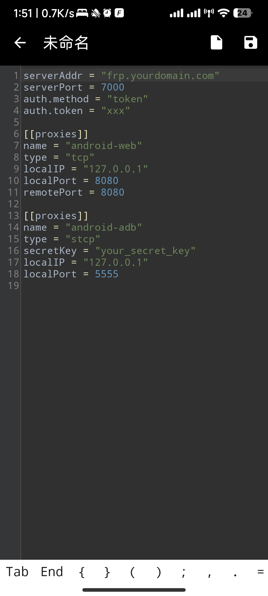
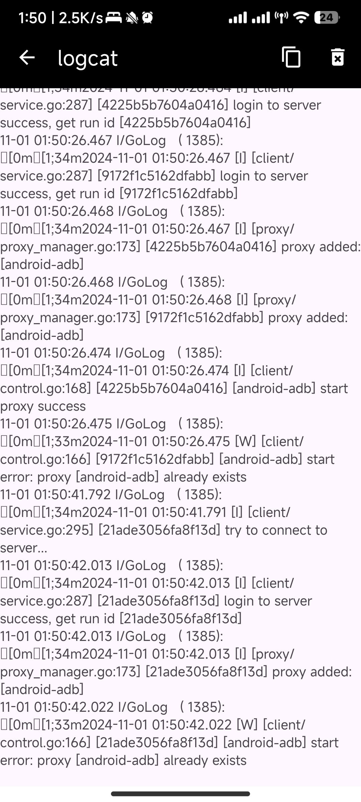

### [frp](https://github.com/fatedier/frp) 是一个专注于内网穿透的高性能的反向代理应用，支持 TCP、UDP、HTTP、HTTPS 等多种协议。可以将内网服务以安全、便捷的方式通过具有公网 IP 节点的中转暴露到公网。

### 当前frp版本号0.62.0
### 屏幕截图



### 自动化编译发布apk到release方法：
自动编译 Action 文件：[.github/workflows/android_release.yml](.github/workflows/android_release.yml)
第一次需要在 Github 仓库-设置-Action 里面设置三个秘密：
```
ANDROID_KEY_BASE64 # 整个 key 文件转 base64, 不用 openssl
ANDROID_KS_PASS # key 的密码
ANDROID_KEY_ALIAS # key 的别名
```
运行下面推送命令，也可以在 Github Release 手动创建
```shell
git tag version_name
git push --tags
```
等待数分钟后，大功告成

### 编译方法
使用远程仓库的 Github Action 编译: [https://github.com/wilinz/frp-mobile-lib](https://github.com/wilinz/frp-mobile-lib)  
Action 文件：[https://github.com/wilinz/frp-mobile-lib/blob/dev/.github/workflows/release-aar.yml](https://github.com/wilinz/frp-mobile-lib/blob/dev/.github/workflows/release-aar.yml)


